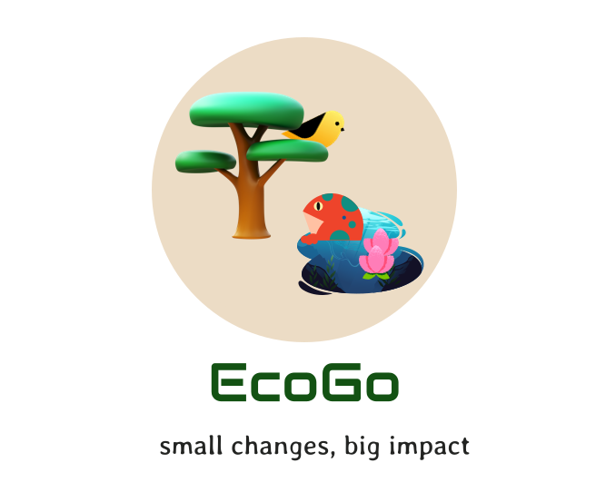

# EcoGo
 

## Project summary

### The issue we are hoping to solve

___Have you ever wondered what impact your daily household products can have on the environment?___

Seemingly unharmful products may contain ingredients that might be toxic to the environment. As awareness about this issue grows, individuals may seek to make informed choices but lack the time or reliable sources to conduct thorough analyses of the impact of their consumption patterns on the environment. Consequently, there exists a pressing challenge to facilitate timely, credible, and convenient access to information that empowers individuals to make informed and environmentally responsible decisions.

### Our idea

We have come up with a solution to provide people with an enabling platform to assess and understand the risks their choices pose to the environment and thus make informed and sustainable decisions to prevent any kind of damage to the environment.
Our app is designed to help individuals make informed and environmentally responsible decisions by providing them with easy access to information about the impact of ingredients in household products on the environment.

## Tech-Stack Used:

- [Flutter](https://flutter.dev/) -  We chose to use Flutter to develop our app because it allowed us to build high-performance, cross-platform mobile applications with a single codebase. This helped us to reduce development time and costs, while also providing a seamless user experience across different platforms. 

- [FireBase](https://firebase.google.com/) - We used FireBase as our backend as a service (BaaS) platform. We leveraged Firebase Realtime Database for real-time data synchronization. These services allowed us to rapidly build and deploy our application while also ensuring scalability and real-time data synchronization.

- [Cloud Run](https://cloud.google.com/run) - We selected Google Cloud as our cloud infrastructure provider due to its flexibility, scalability, and advanced features. For container deployment, we used Google Cloud Run. This allowed us to easily manage and deploy containers in a scalable, highly
available and secure environment.

- [TensorFlow](https://www.tensorflow.org/) - We have developed a tensorflow model for prediction of the toxicity levels of ingredients in the product.

- [Python](https://www.python.org/) - We have used Python 3 to implement the web scraper to identify and evaluate product details.

## Presentation materials

- [Demo Video](https://www.youtube.com/watch?v=bVlzJcrb-Ho)

### Project Development

The project currently does the following things.

- Search Products
- Fetches the product's overall impact on the environment 
- Ingredient Wise Analysis
- Include suggestions for alternative green products 

In the future we plan to:
- Extend our app to include various types of products over various categories
- Improve the performance of the trained model by training over various datasets and improving its architecture


## The Set-Up
### How to run the project

1. Clone the repository:

```
$ git clone https://github.com/OjashGupta/Ecogo-Codeforchange.git
```
2. Open the project in your favorite IDE. We recommend using Android Studio, which has built-in support for Flutter development.

3. Install the Flutter SDK by following the official documentation. Make sure to install the necessary dependencies based on your operating system.

4. Install the project dependencies by running the following command:

```
$ flutter pub get
```

5. Run the app on your preferred device or emulator using the following command:

```
$ flutter run
```

__NOTE__: Please note that this repository contains hidden files that may contain API keys or other sensitive information. These files are not tracked by Git and should not be committed to the repository. If you clone or fork this repository, please make sure to properly secure these files and do not share them publicly.


## Live Demo
You can find a running system to test at [LINK TO APK FILE](https://drive.google.com/drive/folders/1iG0kaikRgELHVdJOrFz_YIEHlTiloe9w?usp=sharing). Download the file in your phone to install the app.
